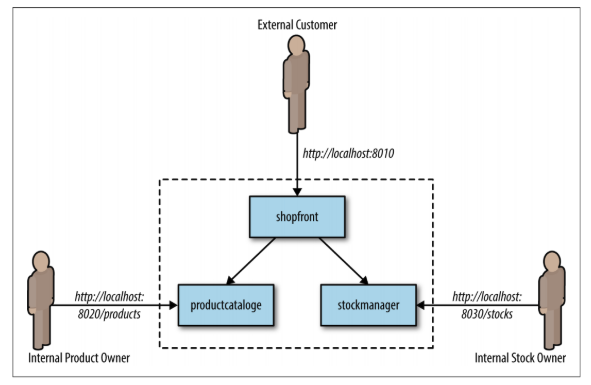
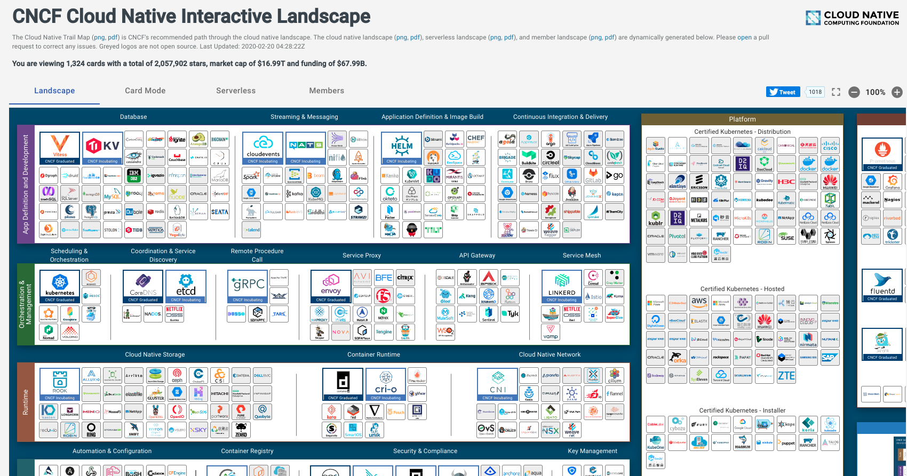

# Kubernetes!

 [Steve Miller](https://www.r15cookie.com) - Devops Practioner


---

## Goal

Cover the essential steps to run an application in Kubernetes!

<aside class="notes">
  Migth want to emphasis not necessarily production, or automated...but at least stpes are there.
  Questions to ask audience to taylor presentation:
    * What does everyone do.  Deveopers/Operations/DevOps
    * Have many people of used docker?  Dockerized an app?
    * Exposure to Kubernetes?
</aside>


---


## What Is Kubernetes!

<aside class="notes">
  5 min

  A (air-quote)"better" way to run applications.  A series of abstractions that let me run code in a consistent manner across several type  of infrastructure.

  Microservice architecture

  Need to coordinate all these services...which is what Kubernetes is all about.
</aside>

---

## Containers

Containers: a really, really fancy way to isolate and configure running processes.

**Docker**...and others...

<aside class="notes">
    5 min
    Containers: The core building blocks
    Containers -> a really, really fancy way to isolate and configure running programs.

    Generally run in their own isolated filesystem, isolated process namespace, and isolated network

    But...beware security, as depending on infrastructure and configuration, but not be as isolated as one would hope.
</aside>

---

## Step 1: Install Docker Desktop

Kubernetes Included (optionally)!

<aside class="notes">
    3 min...just shoinwing screenshots of installation/config on mac/windows
    Go over basics of containers...follow downward if we need to dig into further

    Mention could be anything that build docker containers...docker open source, or OCI compabile software like buildah
</aside>

---

## Step 2: Containerize My Java App!

Going to start from an example microservice app



<span style="font-size:12pt;">Source: Bryant, Daniel. (2017). Containerizing Continuous Delivery in Java.</span>

<aside class="notes">
    Time: 10 min
    Take existing Springboot app, buildable by Maven, and show with example of build.
    Original: https://github.com/danielbryantuk/oreilly-docker-java-shopping/
    Customized for this presentation: https://github.com/danielbryantuk/oreilly-docker-java-shopping/ (Apache 2.0 license, so good for modification.)

    Manually run docker container on it's own.
    Discuss assumptions...
    But...why is this important?
</aside>

--

## 12-factor App

Not required, but super helpful
[https://12factor.net/](https://12factor.net/)

<aside class="notes">
  One of the keys to understaing Microservice architecture...and k8s overall
  #3: Store configs in environment
  #6: Stateless processes
  #9: Disposability
</aside>

--

## Simple Docker Build

```
FROM openjdk:8-jre
ADD target/shopfront-0.0.1-SNAPSHOT.jar app.jar
EXPOSE 8010
ENTRYPOINT ["java","-Djava.security.egd=file:/dev/./urandom","-jar","/app.jar"]
```

<aside class="notes">
  Lines of Docker File
    * FROM - base image.  Talk about trusted base images
    * ADD - add file to the image
    * EXPOSE - exposed port...more important if just running in docker itself
    * ENTRYPOINT - Command to run when starting docker container
  
  * This method works...but build process is outside of docker.
  * We are still depending on local build environment, so harder to reproduce.
</aside>

--

## Docker Builds

Use docker to build AND package app.

<aside class="notes">
  TODO: Slightly modified with Maven build, as well as layered containers.

  Additional Lines
  * FROM ... AS : Allow reference for multi-stage build
  * RUN : Run command within docker, creating new layer
  * COPY --from=builder : Move files from previous build
</aside>


---

## Step 3: Get it in Kubernetes!

<aside class="notes">
    Time: 10 min
    Show deployment of container in Kubernetes.  Not sure if I want to do straight kubectl command, or perhaps show off some yaml
    Also, make note that this is NOT how you generally would deploy in production

    Just demo with "port-forward"...then expose later to world!
</aside>

--

## Deploy all three Microservices

Kubernetes constructs:
* Pod
* Deployment (manages Pods)
* Service (exposes a group of pods to other pod, or potentially to the outside world)
* Ingress (more sophisticated way to expose an applicaton to the outside word)

<aside class="notes>
  With all three containers created:
  * Create deployment
  * Show pods created.  Use port-forward to demo that pod is listening
  * Create service for all three "applications"
  * Create an ingress to expose front end
  * Demo fully operational app
  * Demo deleted a pod, and deployment recreating
</aside>

--

## Remember...Don't Treat Containers like VMs
Should be disposable and horizontally scalable.

<aside class="notes">
  Kuberentes has no concept of "migrating" containers.  For instance, if an individual host is killed off,
  k8s will simple spin up a new container.
</aside>

--

## Design Patterns!

  * Oreilly's Designing Distributed Systems book
  * Microsoft [Design Pattern Page](https://docs.microsoft.com/en-us/azure/architecture/patterns/): A bit Azure focused, but mostly useful across cloud providers/on-prem


---

## Step 4: Orchestrate Some Microservices!

<aside class="notes">
  Time: 10 min
  Demonstrate multiple micro-apps in kubernertes
  Demonstrate Ingress, and exposing to outside world
</aside>

--

## Java Considerations

Memory

<aside class="notes">
  Docker container and JVM, by default, will see entire memory of machine!
  https://jaxenter.com/nobody-puts-java-container-139373.html
    JDK 9 or greater
    Specifically the following JVM options: -XX:+UseCGroupMemoryLimitForHeap
    -XX:+UnlockExperimentalVMOptions

</aside>

---

## What Does Kubernetes Get Me?

Your app just needs to worry about it's function.  Seperate functions can be configured to handle:
* Load balancing
* Health checks and automatic application restarts
* Deployment and Rollback
* URL Routing
* TLS Termination
* Authentication
* Metrics, Logging, Healthchecks


<aside class="notes">
  Time: 5 min
  Step back...what does this buy me as a developer
</aside>

---

### Kubernetes and Microservice Downsides

  * Downsides of Microservices in General
  * Distributed Tracing
  * A Fluid Environment 



<aside class="notes">
  Time: 5 min, including solutions

  * Downsides of Microservices
    * How to segment services
    * Debugging a Distributed System
    * Testing
</aside>

--

## Solutions

  * Microservices: Rapid development, 
  * Visibility: OpenTelemetry, Airbrake, etc. 
  * [KubeProd](https://kubeprod.io/): Bitami service to lay out a lot of the good initial infrastructure. 

<aside class="notes">
  Recomment "looking" at Kubeprod, but deploying individual services yourself as necessary.
</aside>


--

## Places to Host Kubernetes 

* Big Cloud Providers( **Google Cloud GKE**, AWS EKS, Azure AKS)
* From https://free-for.dev/ (Below are Kubernetes Namespace as a Service)
  * https://kubesail.com/: 1 Core of CPU, 512MB of RAM, 100MB of storage and 1 domain
  * https://k8spin.cloud/: 100 mCore of CPU, 128MB of RAM.
  * https://okteto.com/: Three namespaces, each with 8GB of RAM, 4 CPUs and 150GB Disk space.

<aside class="notes">
  * GKE not bad, assuming you use preemtable instances...and DON'T use their load balancer/ingress that will run $20/month
  * Free for dev services I've only lightly tested
    * k8spin.cloud: Super easy entry (can tie to Github account
</aside>


---

## Thank You!

https://www.github.com/ssmiller25/k8s-intro

https://www.r15cookie.com


---


## Resources

  * Oreilly's Designing Distributed Systems
  * Digital Ocean [Kubernetes for Full Stack Developers](https://www.digitalocean.com/community/curriculums/kubernetes-for-full-stack-developers)
  * Aqua Security [Kubernetes 101](https://www.aquasec.com/resources/kubernetes-101/)
  * The DevOps Handbook (Companion ot the Phoenix Project) 
  * [Hipster Shop](https://github.com/GoogleCloudPlatform/microservices-demo)

--

## Other Research Items to Pursue

  * Skaffold
  * Service Mesh: Istio or Linkerd
  * gRPC
  * ArgoCD or Tekton Pipelines
  * Flux

--

## Resources - CKA Exam
  * CKA Exam
    * https://www.contino.io/insights/the-ultimate-guide-to-passing-the-cka-exam 
    * https://github.com/cncf/curriculum
    * https://www.katacoda.com/courses/kubernetes/playground 
    * https://blog.autsoft.hu/certified-kubernetes-administrator/


<aside class="notes">
  TODO: Gather resourcss for the developer certification
</aside>
--

## Sources

[Managing Kubernetes Containers in Docker](https://www.oreilly.com/content/how-to-manage-docker-containers-in-kubernetes-with-java/)
  * Warning: Some references are a bit dated, but still a good book.  See the updates I made in my repo at [Oreilly](https://github.com/ssmiller25/oreilly-docker-java-shopping)
[Oreilly Java Shoppint App](https://github.com/danielbryantuk/oreilly-docker-java-shopping/)