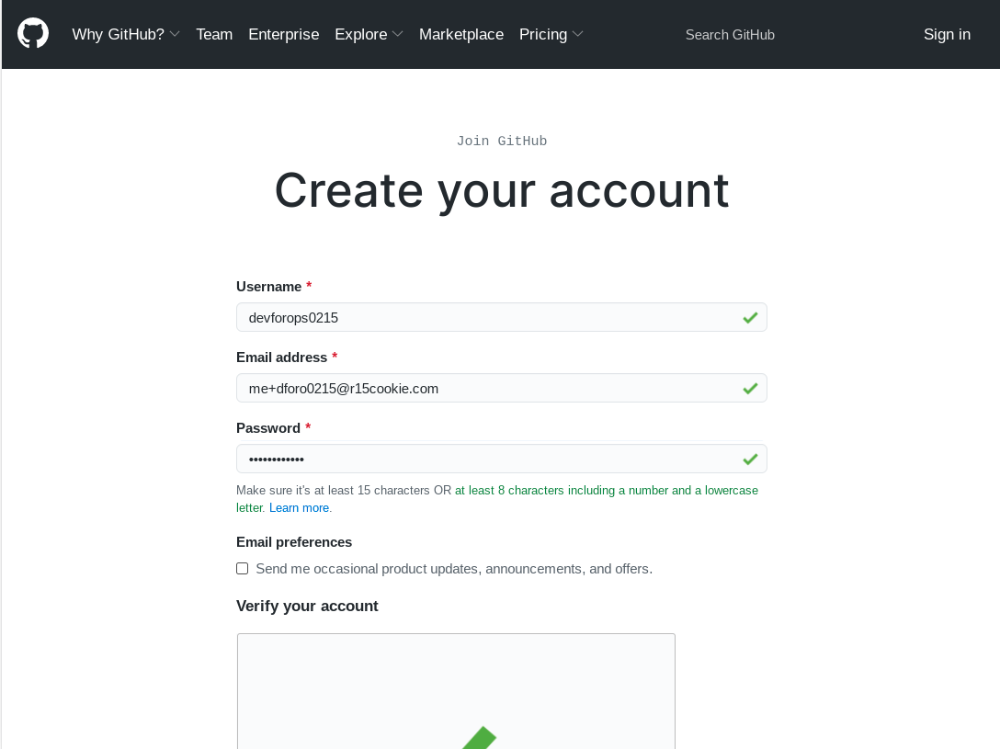
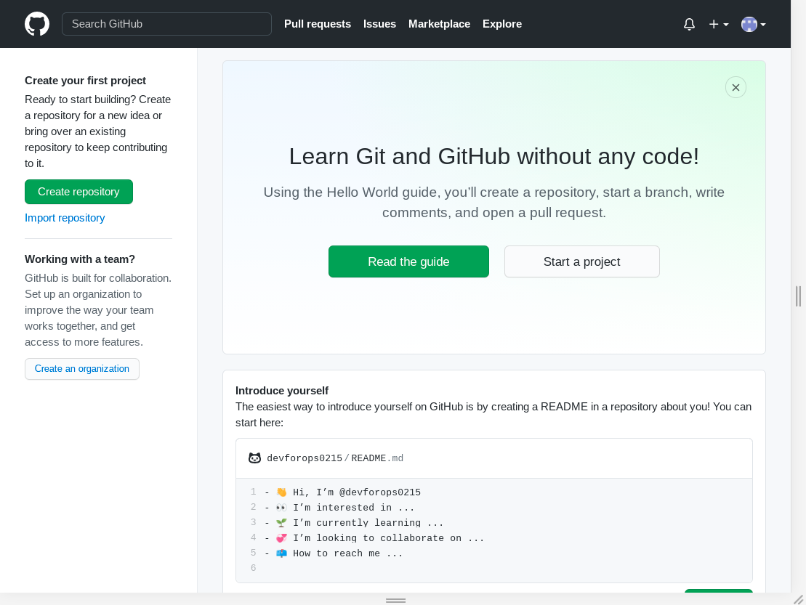
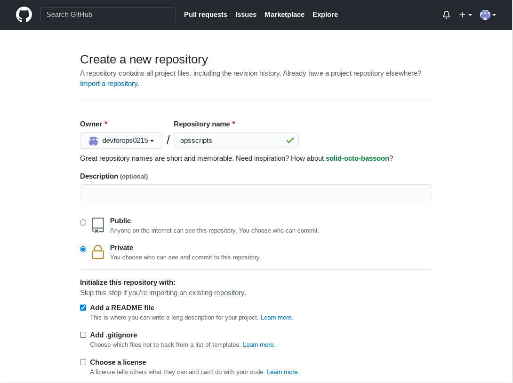
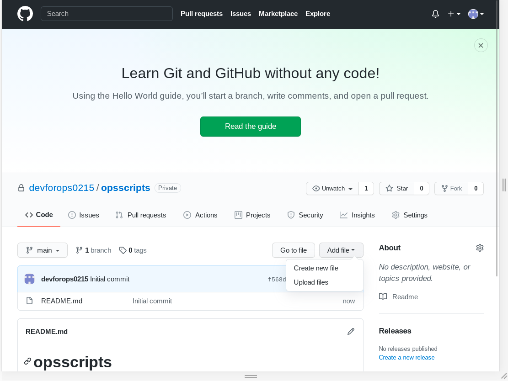
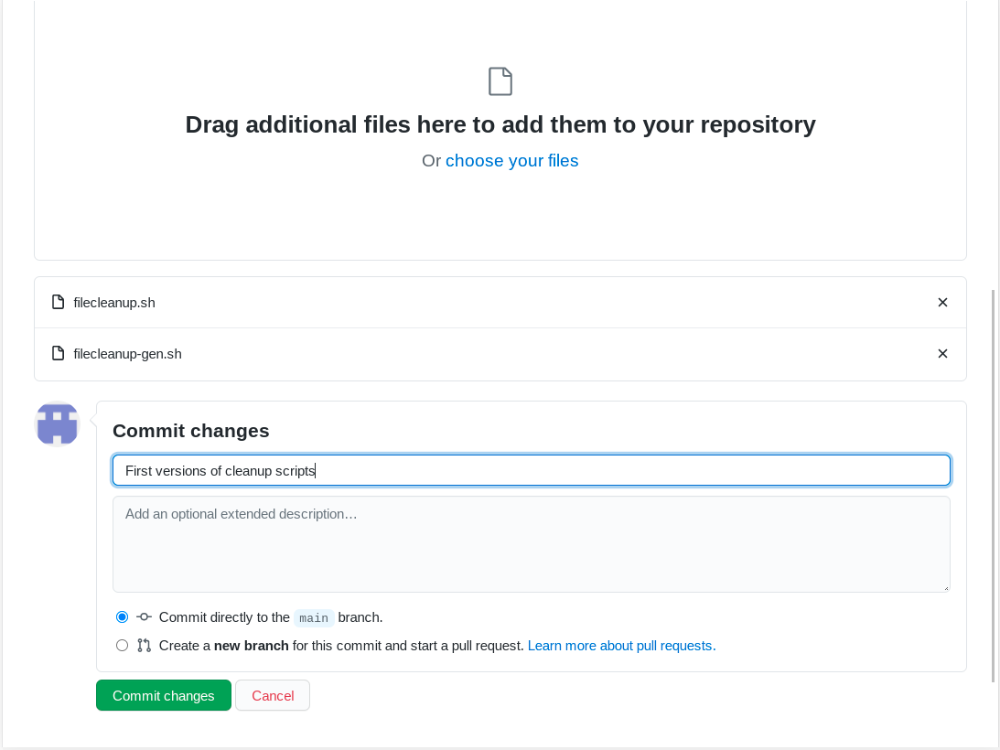
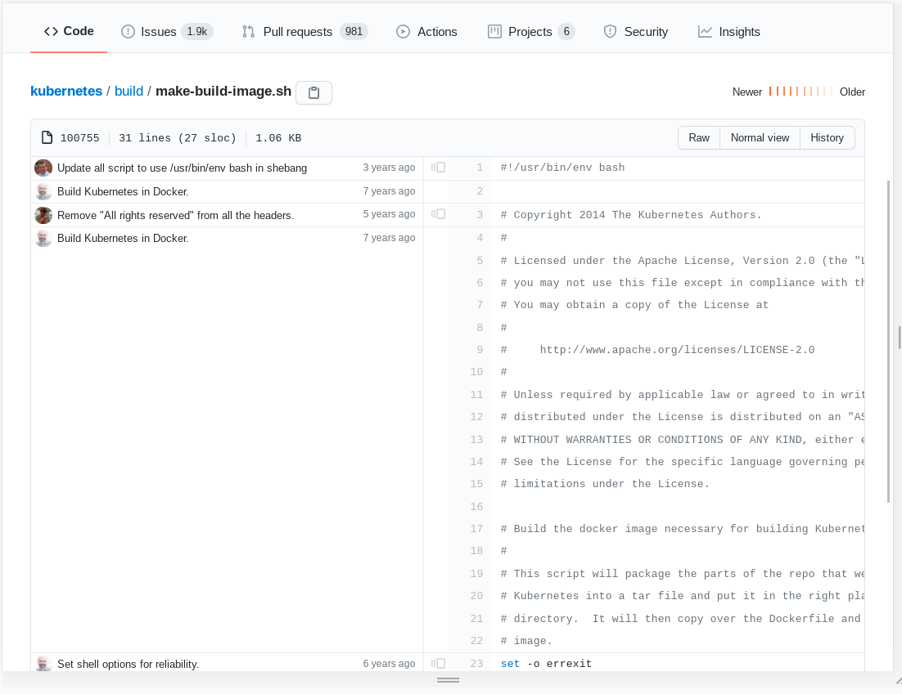
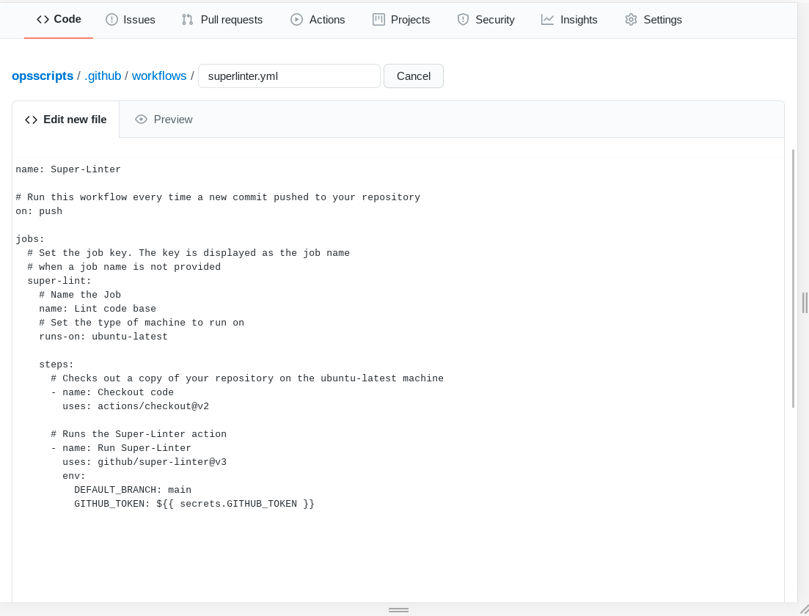
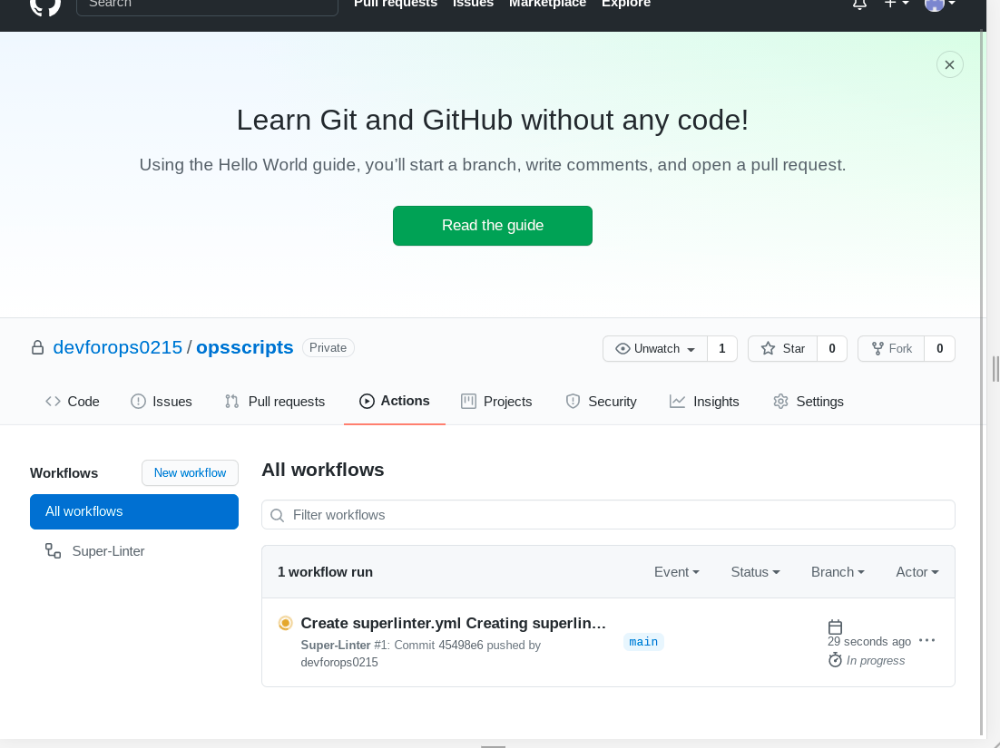
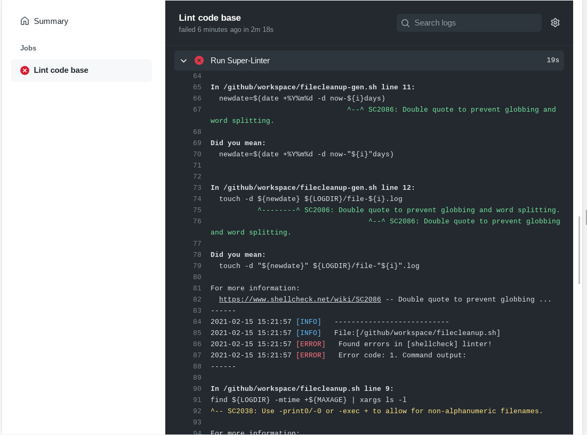

## Incorporating Development Practices in Operations

 [Steve Miller](https://www.r15cookie.com) 

- Devops Practioner
- Sr. Systems Engineer at Plex Systems (Not **that** Plex...)

Note:

GOAL: 30 minutes presentation, with 15-30 minute Q&A

- Introduction of myself
  - Sr. Systems Engineer at Plex
  - Multiple other Devops and System Admin roles across a variety of company sizes as well as public institutions
  - Passion for DevOps Pratices

<!--s-->

## Goal

Make operations more efficent by leveraging development tools and techniques.

Note:

- Notice not calling this "DevOps".  A far larger topic that generally involves having a far deeper connection between operatiosn and production.
  - Focus on existing operational teams, and practices to make them more efficent (Agile)
- Survey
  - How would you describe your team or position:
    - Ops Focused (Sysadmin, etc.)
    - Dev Focused (Software Engineer, etc. )
    - DevOps (Full Stack, Site Reliability, Devops)
  - OS Platforms:
    - Linux
    - *nix
    - Windows
    - Docker

<!--s-->

## Selling Change

Change is hard - make sure you have a good plan to sell it.

Note:

- No matter if your an individual contributor pitching this to your team or a manager, you need to get buy-in.

<!--v-->

## Selling Change

- Highlight Benefits
  - Reduce toil
  - True History of Changes - including authorship
  - Documentation
  - Peer Review workflow

Note:
- Toil, as defined by Googe:  <https://sre.google/sre-book/eliminating-toil/>
- History of changes
  - How many times have you seen a recent change, and when "why"...and really "who did this change"
  - Why is this particular flag flips...say a configuration on a load balancer
- Documentation: Reduce hidden processes.
  - At a minimum you have a script that can be reviewed for the process
  - Better yet, documentation alongside the script explaining the "why"
- Peer Review Workflow
  - Make everyone better by requiring at least one person to review

<!--v-->
## Selling Change

- Address Concerns
  - "In a outage situation, this may slow me down"
  - "I don't want to be a programmer"

Note:

- Benefits
- "In an emergency, I just want to change a setting to fix something": 
  - More of an issue with high-end automation (GitOps, etc).  Code actually managing infrasture/settings
  - One off changes increase "tech debt".  Make sure, at a minimum, to have a process to review and eliminate the reason for the one-off change
  - That's ok, but how do we remember why that setting was changed in future years.   Even if put into a change management system, searching for it can be difficult
- "I don't want to be a programmer"
  - You don't need to be a full programmer
  - We work in IT, whose overall goal is to make our business more efficient by making processes more efficient and less manual.   We need to embrace that internally.

<!--v-->
## Selling Change

Work within your environment

Note:

- I will be highlighting specific tools - but in reality, you should embrace tools already in use by your organization.
- Although not focusing on Devops, reach out to your developers, and see if you can align with their tooling and methodology
  - Code editor(s)
  - Version Control
  - Pipelines
- But do **not** if it does not line up with your goals

</notes>

<!--v-->

## Selling the benefit, and address the concerns

Don't try to "boil the ocean"

Note:

- There are a lot of opportunity, but don't let that impede you from taking more immediate action. 
- Better to take an Agile approach overall versus waterfall

<!--s-->
## Step 1: Scripts

- Might already have them
- Or look for areas of toil that could be improved
  - Manual
  - Repetitive
  - Automate-able

Note:

- Scripts - but don't have to be too complex
  - Might already have these in place - in that case, work from those scripts that you are already using
  - More common in Linux environments, but Windows shops may have quite a collection of powershell as well
- Example areas
  - Maintenance windows - probably common processes that are manually can be error prone due to human need
  - Page-able events - is there a common "page" and a set of actions to resolve (look at X items and perform Y actions)

<!--v-->
## Step 1: Scripts

Scripting Langauges

- **Linux:** Shell/Python
- **Windows:** Powershell

Note:

- Languages to focus on initially
- Target existing experience

<!--v-->
## Step 1: Scripts

Hands On Example: Log Cleanup

- First have to have some test logs

```sh
#!/bin/sh
LOGDIR=${LOGDIR:="/tmp/logdir"}
mkdir -p $LOGDIR
for i in $(seq 1 14); do
  newdate=$(date +%Y%m%d -d now-${i}days)
  touch -d ${newdate} ${LOGDIR}/file-${i}.log 
done
```

Note:

- Cleanup files older then X on a regular basis
- COPY: Links to actual "raw" download on Github

<!--v-->
## Step 1: Scripts

Hands On Example: Log Cleanup

```sh
#!/bin/sh

LOGDIR=${LOGDIR:="/tmp/logdir"}
MAXAGE=${MAXAGE:="7"}

find ${LOGDIR} -mtime +${MAXAGE} | xargs ls -l
```

<sub>Avoiding the actual deletion...</sub>

Note:

- Now we clean up the files
  - Yes, not really putting the delete in there...just in case...

<!--s-->

## Step 2: Version Control

Manage that code properly.  For operations

- Infinite Backups
- Blame Reports
- Peer Review and Approval

Note:

Selling points

- Infinite backups.  Not just the .bak, .bak2 or .20210201 extensions
- Blame reports.  Every wonder how added a line..and why?
- Peer review.  Actually force someone else to read your scripts.  Increases chances for catching mistakes

<!--v-->
## Step 2: Version Control

Github - A good place to get started

Note:

- Need both a source control system along with the system around code reviews, pipeline automation , etc
  - Github ideal if getting started.  Well known in the public community, owned by Micorosft
  - Other ones you might run already in your company
    - Azure DevOps (what was Microsoft TFS a **long** time ago)
    - Atlassian BitBucket
    - Gitlab
    - And many other options
- HANDSON: VSCode and Github tutorial
  - Signup for github:  https://www.github.com
  - Will need a legit email.
  - Create our first repo
  - Pay attention to **private** or **public**
  - Also, emphasis **no private data should ever be uploaded to a repo directly!**
  - Upload scripts through Web Interface
  - Edit script in Web Interface to add description
  - Look at history
  - Look at history and blame report ofr bigger file: <https://github.com/kubernetes/kubernetes/blob/master/build/make-build-image.sh>
- Resources:
  - [Github Hellow Word](https://guides.github.com/activities/hello-world/)
  - [Git Flow](https://guides.github.com/introduction/flow/)

<!--v-->

## Step 2: Version Control


Note:

Backup - Github Walk-through

<!--v-->

## Step 2: Version Control



Note:

Backup - Github Walk-through - signup

<!--v-->

## Step 2: Version Control



<!--v-->

## Step 2: Version Control



<!--v-->

## Step 2: Version Control



<!--v-->

## Step 2: Version Control



<!--v-->

## Step 2: Version Control




<!--s-->

## Step 3: Pipelines for Your Scripts

- Add intelligence to your repo
  - Testing
  - Implementation

Note:

HANDSON: Gitlab Actions walk-through
Once you are used to using a repo with your code, take advantage of pipelines to help automatically test and deploy your code.

- Only looking at some testing
- Deployment a larger subject
- [SuperLinter tutorial](https://docs.github.com/en/actions/quickstart)
  - Commit to main branch (although PR could be more appropriate for larger installs)
  - Wait for Output (or step ahead for screenshot below)
  - If time, submit PR to fix errors, view output
  - And use PR as opportunity to demo how Pull Requests work, with Peer Reviews

<!--v-->

## Step 3: Pipelines for Your Scripts

Create workflow configuration - Github's "Super Linter"



<!--v-->

## Step 3: Pipelines for Your Scripts

Runs on commits



<!--v-->

## Step 3: Pipelines for Your Scripts

Error




<!--s-->
## Conclusion

- Big Steps
  - Reduce toil by developing code
  - Put Code into version control
  - Develop pipelines and review processes to make code better
- Assist in:
  - Uptime - more automation and repeatable processes
  - Documentation: source code itself, along with other artifact, can serve as an important

<!--v-->

## Conclusion

- Taking it Further
  - IDE Environments (Visual Studio Code)
  - Infrastructure as Code (IaC)
  - Configuration Management
  - Gitops/Kubernetes

Note:

- IDE
  - Visual Studio Code
  - Probably do not want to manually upload/edit on web interface
  - VSCode is extremely popular in the lightweight IDE category
- Iac Frameworks
  - Useful for more cloud-based architectures
  - Terraform (probably biggest)
  - Pulumi
- Configuration Management
  - Useful for more traditional infrastructure.  In order of my preference
    - Ansible
    - Salt
    - Chef
    - Puppet
- GitOps/Kubernetes
  - More for Microservice styled architectures - but worthy of it's own discussion


<!--s-->

## Thank You

<https://present.r15cookie.com>

<https://www.r15cookie.com>

<!--v-->

## Additioanl Resources

- Ansible
  - [Redhat's Ansible Quickstart Guide](https://www.redhat.com/sysadmin/ansible-quick-start)
- Github
  - [Guides](https://guides.github.com/)
  - [Docs](https://docs.github.com/en)
  - [Oh Shit, Git!?!](https://ohshitgit.com/)
- [Visual Studio Code](https://code.visualstudio.com/)
- Google SRE Books
  - [Site Reliability Engineering](https://sre.google/sre-book/table-of-contents/)
  - [Site Reliability Workbook](https://sre.google/workbook/table-of-contents/)
  - [Building Reliable and Secure Systems (PDF)](https://static.googleusercontent.com/media/sre.google/en//static/pdf/building_secure_and_reliable_systems.pdf)